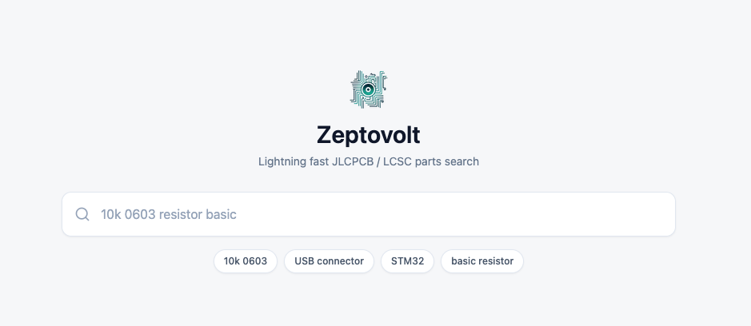
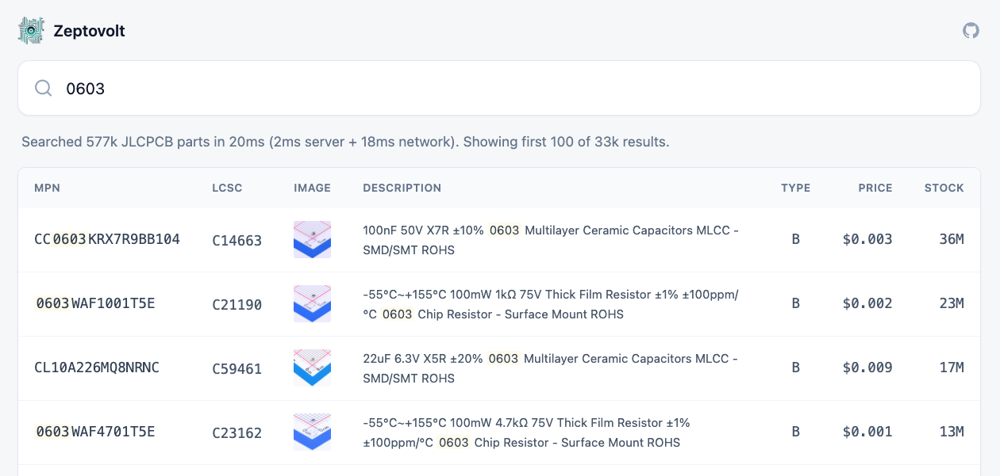

# Zeptovolt

Zeptovolt is a Rust-backed JLCPCB parts search with full regex support, parallelized scans, and prefix-aware bitmap caching over a regularly refreshed public parts dataset.

It's backed by data from [yaqwsx/jlcparts](https://yaqwsx.github.io/jlcparts) and typically returns search results more than 10x faster.

## Quickstart

You can use the service at [zeptovolt.com](https://zeptovolt.com).

## Screenshots

## Performance

| Query | Cold | Warm | yaqwsx/jlcparts | Matches |
|---|---:|---:|---:|---:|
| `0603` | `57.75ms` | `907.92us` | `4173ms` | `33,474` |
| `10k` | `43.48ms` | `198.08us` | `4843ms` | `6,561` |
| `0603 10k` | `73.32ms` | `79.50us` | `6155ms` | `586` |

Zeptovolt's listed latencies do not include network time, which will add 100-200ms in practice.

## Implementation Details
The backend is a threaded Rust/Axum search service. It downloads the public JLC parts dataset, stores each query's matches as a compressed bitmap, resolves multi-term searches with fast bitmap intersections, and scans uncached terms in parallel with Rayon.

## Related

- [yaqwsx/jlcparts](https://github.com/yaqwsx/jlcparts) Zeptovolt uses the data published by this project as its upstream source, while keeping the searchable index server-side for faster lookups.
